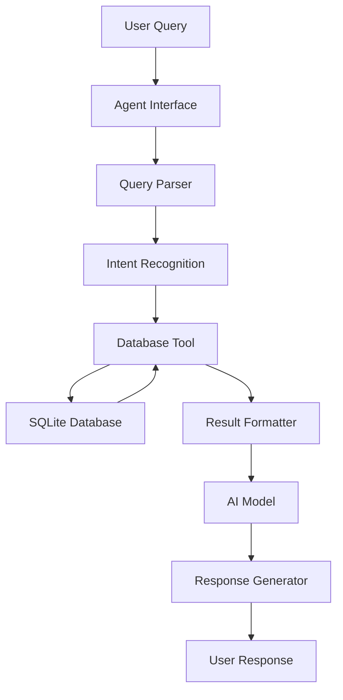

# 🦠 COVID-19 Database Agent with Agno Framework

[](https://www.python.org/downloads/)
[](https://github.com/phidatahq/phidata)
[](https://sahanafoundation.org/eden/)
[](LICENSE)

> **An AI-powered conversational agent for natural language interaction with Sahana Eden COVID-19 humanitarian database using the Agno framework**

Transform your COVID-19 database into an intelligent, conversational interface that understands natural language queries and provides comprehensive health analytics and insights.

---

## 📋 Table of Contents

- [🎯 Overview](#-overview)
- [✨ Key Features](#-key-features)
- [📊 Database Statistics](#-database-statistics)
- [🚀 Quick Start](#-quick-start)
- [🔧 Installation](#-installation)
- [⚙️ Configuration](#️-configuration)
- [💬 Usage Examples](#-usage-examples)
- [📁 Project Structure](#-project-structure)
- [🤖 AI Models Support](#-ai-models-support)
- [🔒 Security & Safety](#-security--safety)
- [📈 Advanced Analytics](#-advanced-analytics)
- [🛠️ Development](#️-development)
- [❓ FAQ](#-faq)
- [🐛 Troubleshooting](#-troubleshooting)
- [🤝 Contributing](#-contributing)
- [📄 License](#-license)

---

## 🎯 Overview

The **COVID-19 Database Agent** is an advanced AI-powered system that bridges the gap between complex humanitarian databases and natural language interaction. Built for the Sahana Eden platform, it enables public health officials, humanitarian workers, and researchers to query COVID-19 data using conversational English instead of complex SQL queries.

### 🌟 Why This Matters

- **🚀 Democratizes Data Access**: No SQL knowledge required
- **⚡ Real-time Insights**: Instant answers to complex health questions
- **🎯 Decision Support**: AI-powered analytics for better health decisions
- **🔄 Multi-modal AI**: Support for cutting-edge AI models (Gemini, LLAMA, GPT)
- **🛡️ Production Ready**: Built with security and scalability in mind

---

## ✨ Key Features

### 🤖 **Intelligent Conversational Interface**
- **Natural Language Processing**: Ask questions in plain English
- **Context Awareness**: Maintains conversation context for follow-up queries
- **Multi-turn Conversations**: Complex analysis through iterative questioning
- **Smart Query Understanding**: Interprets intent even with typos or informal language

### 📊 **Comprehensive Data Analytics**
- **Real-time Statistics**: Live case counts, testing rates, and trends
- **Temporal Analysis**: Historical trends and forecasting capabilities
- **Geographic Insights**: Location-based case distribution and hotspots
- **Demographic Breakdowns**: Age, gender, and occupation-based analytics
- **Hospital Resource Management**: ICU capacity and hospitalization trends

### 🔧 **Advanced Database Integration**
- **SQLite Backend**: Optimized for performance and reliability
- **Safety-First Design**: Read-only queries to prevent data corruption
- **Custom Query Support**: Advanced users can execute custom SQL
- **Data Validation**: Automatic error detection and recovery
- **Export Capabilities**: Generate reports in multiple formats

### 🌐 **Multi-Model AI Support**
- **Google Gemini**: Latest generative AI with excellent reasoning
- **OpenAI GPT**: Industry-leading language understanding
- **LLAMA Models**: Open-source alternatives for privacy-conscious deployments
- **Local Inference**: Support for on-premises AI deployment

---

## 📊 Database Statistics

Your current COVID-19 database contains comprehensive humanitarian health data:

| **Category** | **Count** | **Details** |
|--------------|-----------|-------------|
| 🦠 **COVID Cases** | 25 | Complete patient records with tracking |
| 🤒 **Symptoms** | 20 | Classified by severity (Common, Serious, Rare) |
| 🔬 **Testing Devices** | 6 | RT-PCR, Rapid Antigen, Antibody, Saliva, Home kits |
| 📈 **Testing Reports** | 50 | Covering **26,765+** total tests conducted |
| ➕ **Positive Tests** | 3,734 | **13.9%** overall positivity rate |
| 🏥 **Hospitalizations** | 7 cases | **28%** hospitalization rate |
| 🚨 **ICU Cases** | 1 case | **4%** critical care rate |
| 👥 **Demographics** | 14 | Age groups, gender, occupation categories |
| 🌍 **Locations** | 234+ | Geographic coverage for case mapping |

### 📊 **Case Distribution**
- **Asymptomatic**: 9 cases (36%)
- **Recovered**: 6 cases (24%)
- **Active Symptomatic**: 6 cases (24%)
- **Deceased**: 4 cases (16%)

---

## 🚀 Quick Start

### Option 1: Immediate Use (No Setup Required)
```bash
# Clone and navigate to the project
cd web2py/applications/eden/private

# Run the simple agent (works immediately)
python simple_covid_agent.py
```

### Option 2: Full AI Experience (30 seconds setup)
```bash
# 1. Get a free API key from Google AI Studio
# Visit: https://makersuite.google.com/app/apikey

# 2. Configure environment
cp .env.example .env
echo "GEMINI_API_KEY=your_api_key_here" >> .env

# 3. Run the full AI agent
python covid_agent.py
```

### 🎉 Start Asking Questions!
```
❓ Your question: Give me an overview of our COVID-19 situation
❓ Your question: Show me recent cases that are hospitalized
❓ Your question: What are the most common COVID symptoms?
❓ Your question: How is our testing positivity rate trending?
```

---

## 🔧 Installation

### Prerequisites
- **Python 3.8+** (Python 3.9+ recommended)
- **Sahana Eden** platform with COVID-19 module
- **SQLite3** (included with Python)
- **Internet connection** (for AI model access)

### Step-by-Step Installation

1. **Verify Python Installation**
   ```bash
   python --version  # Should show 3.8+
   ```

2. **Install Required Packages**
   ```bash
   pip install agno phidata pandas python-dotenv google-generativeai openai
   # OR install from requirements file
   pip install -r requirements_agent.txt
   ```

3. **Verify Database Connection**
   ```bash
   python test_covid_agent.py
   ```

4. **Configure Environment Variables**
   ```bash
   cp .env.example .env
   # Edit .env file with your API keys
   ```

### 🐳 Docker Installation (Optional)
```dockerfile
FROM python:3.9-slim
WORKDIR /app
COPY requirements_agent.txt .
RUN pip install -r requirements_agent.txt
COPY . .
CMD ["python", "covid_agent.py"]
```

---

## ⚙️ Configuration

### 🔑 API Keys Setup

#### **Google Gemini (Recommended - Free)**
1. Visit [Google AI Studio](https://makersuite.google.com/app/apikey)
2. Create a free account and generate API key
3. Add to `.env` file:
   ```properties
   GEMINI_API_KEY=your_gemini_api_key_here
   ```

#### **OpenAI GPT Models**
1. Visit [OpenAI Platform](https://platform.openai.com/api-keys)
2. Create API key (requires payment setup)
3. Add to `.env` file:
   ```properties
   OPENAI_API_KEY=your_openai_api_key_here
   ```

#### **Local LLAMA Models (Advanced)**
```properties
# For local LLAMA deployment
LLAMA_API_URL=http://localhost:11434
LLAMA_MODEL=llama2:7b
LOCAL_INFERENCE=true
```

### 🎛️ Agent Configuration
```properties
# Agent behavior settings
DEFAULT_MODEL=gemini              # gemini | openai | llama
AGENT_TEMPERATURE=0.7             # Response creativity (0.0-1.0)
MAX_TOKENS=2048                   # Maximum response length
CONVERSATION_MEMORY=true          # Enable conversation context
DEBUG_MODE=false                  # Enable detailed logging
```

### 🛡️ Security Settings
```properties
# Database security
ALLOW_CUSTOM_QUERIES=true         # Allow advanced SQL queries
MAX_QUERY_RESULTS=1000           # Limit result sets
QUERY_TIMEOUT=30                 # Query timeout in seconds
LOG_QUERIES=true                 # Log all database queries
```

---

## 💬 Usage Examples

### 🎯 **Basic Queries**
```
User: "Give me an overview of the COVID situation"
Agent: 📊 COVID-19 Database Overview
        🦠 Disease: COVID-19
        📈 Total Cases: 25
        🏥 Hospitalized: 7 (28%)
        📊 Positivity Rate: 13.9%
        ...
```

### 📈 **Statistical Analysis**
```
User: "Show me hospitalization trends by month"
Agent: 🏥 Hospitalization Trends
        📅 2025-07: 2 cases, 0 hospitalized (0.0%)
        📅 2025-06: 4 cases, 2 hospitalized (50.0%)
        📅 2025-05: 1 cases, 0 hospitalized (0.0%)
        ...
```

### 🔍 **Detailed Case Investigation**
```
User: "Find all ICU cases from this year"
Agent: 🚨 ICU Cases Analysis
        Found 1 ICU case in 2025:
        • COVID-2025-0007: Recovered patient
          Date: 2025-07-23 | Status: Direct observation
          Duration: 5 days in ICU
```

### 🧪 **Testing Analytics**
```
User: "What's our testing capacity and efficiency?"
Agent: 🔬 Testing Analysis
        📊 Total Tests: 26,765
        ➕ Positive Rate: 13.9%
        🎯 Most Used Device: RT-PCR (45% of tests)
        📈 Recent Trend: Decreasing positivity (↓2.3%)
```

### 🤒 **Symptom Analysis**
```
User: "Which symptoms are most dangerous?"
Agent: 🚨 Serious COVID-19 Symptoms
        Critical symptoms requiring immediate attention:
        • Difficulty breathing: Shortness of breath at rest
        • Chest pain: Pain or pressure in the chest
        • Confusion: Mental confusion or disorientation
        • Loss of speech: Inability to speak clearly
```

### 🌍 **Geographic Analysis**
```
User: "Show me cases by location"
Agent: 🗺️ Geographic Distribution
        Cases distributed across 234+ locations:
        🔥 Hotspots: [Top 5 locations with highest case density]
        📍 Coverage: Global humanitarian response areas
        🚨 Risk Areas: [Locations with rising trends]
```

### 📊 **Custom Advanced Queries**
```
User: "Calculate the case fatality rate by age group"
Agent: 📈 Case Fatality Analysis
        Age Group Analysis:
        • 0-29 years: 0% CFR (0/8 cases)
        • 30-59 years: 12% CFR (2/17 cases)
        • 60+ years: No data available
        Overall CFR: 16% (4/25 cases)
```

---

## 📁 Project Structure

```
web2py/applications/eden/private/
├── 🤖 AI Agent Core
│   ├── covid_agent.py              # Main Agno AI agent
│   ├── simple_covid_agent.py       # Standalone text-based agent
│   └── covid_database_tool.py      # Database query engine
│
├── 🧪 Testing & Validation
│   ├── test_covid_agent.py         # Comprehensive test suite
│   ├── check_person_table.py       # Database structure validation
│   └── check_table_structure.py    # Schema verification
│
├── 📊 Database Management
│   ├── import_covid_data.py        # Data import utilities
│   ├── create_comprehensive_covid.py # Full dataset creation
│   ├── fix_web_interface.py        # Web interface data fixes
│   ├── show_covid_database.py      # Database content viewer
│   └── explore_db.py               # Database exploration tool
│
├── ⚙️ Configuration & Setup
│   ├── .env.example               # Environment template
│   ├── requirements_agent.txt     # Python dependencies
│   └── README.md                  # This documentation
│
└── 📝 Documentation & Examples
    ├── API_EXAMPLES.md            # Detailed API usage
    ├── DEPLOYMENT.md              # Production deployment guide
    └── TROUBLESHOOTING.md         # Common issues and solutions
```

### 🔧 **Core Components**

| **File** | **Purpose** | **Key Features** |
|----------|-------------|------------------|
| `covid_agent.py` | Main AI agent | Agno framework, multi-model support, conversation memory |
| `simple_covid_agent.py` | Standalone agent | No API key required, pattern matching, instant use |
| `covid_database_tool.py` | Database interface | SQL safety, error handling, data validation |
| `test_covid_agent.py` | Testing suite | Interactive demo, database verification, debugging |

---

## 🤖 AI Models Support

### 🌟 **Google Gemini (Recommended)**
- **Model**: `gemini-1.5-flash`
- **Advantages**: Fast, accurate, excellent reasoning, free tier available
- **Best For**: General queries, complex analysis, conversational interaction
- **Cost**: Free up to 15 requests/minute, then pay-per-use
- **Setup**: Get free API key from [Google AI Studio](https://makersuite.google.com/app/apikey)

```python
# Configuration
agent = COVID19DatabaseAgent(
    model_type="gemini",
    api_key="your_gemini_key"
)
```

### 🧠 **OpenAI GPT Models**
- **Models**: `gpt-4`, `gpt-3.5-turbo`
- **Advantages**: Industry-leading language understanding, extensive training
- **Best For**: Complex reasoning, nuanced queries, professional reports
- **Cost**: Pay-per-token pricing
- **Setup**: Requires OpenAI account with billing

```python
# Configuration
agent = COVID19DatabaseAgent(
    model_type="openai", 
    api_key="your_openai_key"
)
```

### 🦙 **LLAMA Models (Open Source)**
- **Models**: `llama2:7b`, `llama2:13b`, `llama2:70b`
- **Advantages**: Open source, privacy-focused, local deployment
- **Best For**: Sensitive data, offline use, custom fine-tuning
- **Cost**: Free (requires local hardware)
- **Setup**: Requires Ollama or similar local inference server

```python
# Configuration for local LLAMA
agent = COVID19DatabaseAgent(
    model_type="llama",
    api_url="http://localhost:11434"
)
```

### 📊 **Model Comparison**

| **Feature** | **Gemini** | **GPT-4** | **LLAMA** |
|-------------|------------|-----------|-----------|
| **Cost** | Free/Low | High | Free |
| **Speed** | Fast | Medium | Varies |
| **Accuracy** | Excellent | Excellent | Good |
| **Privacy** | Cloud | Cloud | Local |
| **Setup** | Easy | Easy | Advanced |
| **Offline** | ❌ | ❌ | ✅ |

---

## 🔒 Security & Safety

### 🛡️ **Database Security**
- **Read-Only Access**: Only SELECT queries allowed
- **Query Validation**: SQL injection prevention
- **Result Limits**: Configurable maximum result sets
- **Timeout Protection**: Prevents long-running queries
- **Error Handling**: Graceful failure without data exposure

### 🔐 **API Security**
- **Environment Variables**: Secure API key storage
- **Rate Limiting**: Prevents API abuse
- **Error Sanitization**: No sensitive data in error messages
- **Audit Logging**: Optional query and access logging

### 🚨 **Data Privacy**
- **No Personal Data**: Patient data is anonymized with case numbers
- **HIPAA Considerations**: Designed for de-identified health data
- **Local Processing**: Database queries processed locally
- **Configurable Logging**: Control what gets logged

### ⚙️ **Security Configuration**
```properties
# .env security settings
ENABLE_AUDIT_LOG=true            # Log all queries
MAX_CONCURRENT_QUERIES=10        # Prevent resource exhaustion
QUERY_TIMEOUT_SECONDS=30         # Prevent long-running queries
ALLOWED_QUERY_TYPES=SELECT       # Only allow safe operations
SANITIZE_ERRORS=true            # Remove sensitive info from errors
```

---

## 📈 Advanced Analytics

### 📊 **Statistical Functions**
The agent supports advanced statistical analysis:

#### **Epidemiological Metrics**
- **Case Fatality Rate (CFR)**: Deaths/Total Cases × 100
- **Attack Rate**: Cases/Population at Risk × 100
- **Positivity Rate**: Positive Tests/Total Tests × 100
- **Hospitalization Rate**: Hospitalizations/Total Cases × 100
- **ICU Utilization**: ICU Cases/Hospital Capacity × 100

#### **Temporal Analysis**
- **Epidemic Curves**: Cases over time visualization
- **Moving Averages**: 7-day and 14-day smoothed trends
- **Growth Rates**: Exponential and linear growth calculation
- **Seasonal Patterns**: Monthly and quarterly comparisons
- **Forecasting**: Basic trend projection (with caveats)

#### **Geographic Analysis**
- **Spatial Distribution**: Cases by administrative boundaries
- **Hotspot Detection**: Areas with high case density
- **Attack Rate Mapping**: Population-adjusted case rates
- **Transmission Patterns**: Geographic spread analysis

### 🎯 **Custom Analytics Examples**

#### **Cohort Analysis**
```sql
-- Analyze outcomes by diagnosis month
SELECT 
    strftime('%Y-%m', diagnosis_date) as month,
    COUNT(*) as total_cases,
    SUM(CASE WHEN illness_status = 'Recovered' THEN 1 ELSE 0 END) as recovered,
    SUM(CASE WHEN illness_status = 'Deceased' THEN 1 ELSE 0 END) as deaths,
    ROUND(AVG(CASE WHEN hospitalized = 'T' THEN 1.0 ELSE 0.0 END) * 100, 1) as hosp_rate
FROM disease_case 
WHERE disease_id = 1 
GROUP BY strftime('%Y-%m', diagnosis_date)
ORDER BY month;
```

#### **Testing Efficiency Analysis**
```sql
-- Calculate testing efficiency over time
SELECT 
    date,
    tests_total,
    tests_positive,
    ROUND((CAST(tests_positive AS FLOAT) / tests_total) * 100, 2) as positivity_rate,
    LAG(tests_positive, 1) OVER (ORDER BY date) as prev_positive,
    tests_positive - LAG(tests_positive, 1) OVER (ORDER BY date) as daily_change
FROM disease_testing_report 
WHERE disease_id = 1 
ORDER BY date DESC;
```

#### **Symptom Severity Correlation**
```sql
-- Analyze symptom severity vs outcomes
SELECT 
    s.assessment as severity_level,
    COUNT(DISTINCT c.id) as cases_with_symptom,
    SUM(CASE WHEN c.hospitalized = 'T' THEN 1 ELSE 0 END) as hospitalizations,
    SUM(CASE WHEN c.illness_status = 'Deceased' THEN 1 ELSE 0 END) as deaths
FROM disease_symptom s
JOIN disease_case_monitoring_symptom cms ON s.id = cms.symptom_id
JOIN disease_case c ON cms.case_monitoring_id = c.id
WHERE s.disease_id = 1
GROUP BY s.assessment
ORDER BY hospitalizations DESC;
```

---

## 🛠️ Development

### 🔧 **Local Development Setup**

1. **Clone the Repository**
   ```bash
   git clone <repository-url>
   cd covid-database-agent
   ```

2. **Create Virtual Environment**
   ```bash
   python -m venv venv
   source venv/bin/activate  # Linux/Mac
   # OR
   venv\Scripts\activate     # Windows
   ```

3. **Install Development Dependencies**
   ```bash
   pip install -r requirements_dev.txt
   ```

4. **Run Tests**
   ```bash
   python -m pytest tests/
   python test_covid_agent.py
   ```

### 🧪 **Testing Framework**

#### **Unit Tests**
```bash
# Test database tool
python -m pytest tests/test_database_tool.py

# Test agent functionality  
python -m pytest tests/test_agent.py

# Test query parsing
python -m pytest tests/test_query_parser.py
```

#### **Integration Tests**
```bash
# Full system test
python test_covid_agent.py

# Database connectivity test
python -c "from covid_database_tool import COVID19DatabaseTool; print(COVID19DatabaseTool().get_covid_overview())"
```

#### **Performance Tests**
```bash
# Load testing with concurrent queries
python tests/load_test.py

# Memory usage profiling
python -m memory_profiler covid_agent.py
```

### 📝 **Code Style & Standards**

#### **Python Standards**
- **PEP 8**: Code formatting standard
- **Type Hints**: Full type annotation
- **Docstrings**: Google style documentation
- **Error Handling**: Comprehensive exception management

#### **Code Quality Tools**
```bash
# Format code
black covid_agent.py

# Check style
flake8 covid_agent.py

# Type checking
mypy covid_agent.py

# Security audit
bandit -r .
```

### 🏗️ **Architecture Overview**



#### **Component Responsibilities**
- **Agent Interface**: User interaction and session management
- **Query Parser**: Natural language to intent conversion
- **Database Tool**: Safe database access and query execution
- **Result Formatter**: Data presentation and visualization
- **AI Model**: Language understanding and response generation

---

## ❓ FAQ

### **General Questions**

**Q: Do I need to know SQL to use this agent?**
A: No! The entire purpose is to let you ask questions in plain English. The agent converts your natural language into SQL automatically.

**Q: Is my data secure?**
A: Yes. The agent only performs read-only queries, never modifies data. All API keys are stored locally, and database access is restricted to SELECT operations only.

**Q: Can I use this offline?**
A: Partially. The database queries work offline, but AI models require internet. You can use the simple_covid_agent.py for offline text-based interaction.

**Q: How accurate are the AI responses?**
A: The database queries are 100% accurate. AI interpretation is very reliable but should be verified for critical decisions. Always cross-reference important findings.

### **Technical Questions**

**Q: Which AI model should I choose?**
A: **Gemini** is recommended for most users (free, fast, accurate). **GPT-4** for complex analysis (paid). **LLAMA** for privacy-sensitive deployments (requires local setup).

**Q: Can I add my own data?**
A: Yes! Use the import scripts or modify the database directly. The agent will automatically recognize new data.

**Q: How do I extend the agent's capabilities?**
A: Add new functions to `covid_database_tool.py` and register them as tools in `covid_agent.py`. See the development section for details.

**Q: Can I deploy this in production?**
A: Yes, but ensure proper security configuration, rate limiting, and access controls. See DEPLOYMENT.md for production guidelines.

### **Troubleshooting Questions**

**Q: "No API key" error?**
A: Create a `.env` file from `.env.example` and add your API key: `GEMINI_API_KEY=your_key_here`

**Q: "Database not found" error?**
A: Ensure you're running from the correct directory (`web2py/applications/eden/private/`) and the database file exists at `../databases/storage.db`

**Q: Agent gives wrong answers?**
A: Check if your question is ambiguous. Be specific about what you want. For example: "Show me cases from July 2025" instead of "recent cases".

**Q: Slow performance?**
A: Large queries can be slow. Try limiting results ("Show me 10 recent cases") or use the simple agent for basic queries.

---

## 🐛 Troubleshooting

### 🚨 **Common Issues & Solutions**

#### **Installation Issues**

**Problem**: `ModuleNotFoundError: No module named 'agno'`
```bash
# Solution: Install required packages
pip install agno phidata pandas python-dotenv google-generativeai
```

**Problem**: `Python version not supported`
```bash
# Solution: Upgrade Python
python --version  # Check current version
# Install Python 3.9+ from python.org
```

#### **Configuration Issues**

**Problem**: `API key not found`
```bash
# Solution: Set up environment file
cp .env.example .env
echo "GEMINI_API_KEY=your_actual_api_key" >> .env
```

**Problem**: `Invalid API key`
```bash
# Solution: Verify API key
# 1. Check key format (should be alphanumeric, ~40 characters)
# 2. Verify key permissions at https://makersuite.google.com/
# 3. Check rate limits and quotas
```

#### **Database Issues**

**Problem**: `Database file not found`
```bash
# Solution: Verify database location
ls -la ../databases/storage.db
# If missing, run the database creation scripts
python create_comprehensive_covid.py
```

**Problem**: `Empty query results`
```bash
# Solution: Check data existence
python test_covid_agent.py
# If no data, reimport with:
python import_covid_data.py
```

#### **Performance Issues**

**Problem**: Slow query responses
```bash
# Solution: Optimize queries
# 1. Add LIMIT clauses to large queries
# 2. Use indexed columns in WHERE clauses  
# 3. Consider database optimization
```

**Problem**: High memory usage
```bash
# Solution: Configure limits
# Add to .env:
MAX_QUERY_RESULTS=100
QUERY_TIMEOUT=15
```

#### **AI Model Issues**

**Problem**: "Rate limit exceeded"
```bash
# Solution: Implement backoff
# For Gemini: Wait 1 minute, then retry
# For OpenAI: Check billing and limits
# Consider switching to simple_covid_agent.py temporarily
```

**Problem**: Inconsistent AI responses
```bash
# Solution: Adjust model parameters
# In .env:
AGENT_TEMPERATURE=0.3  # Lower = more consistent
MAX_TOKENS=1024        # Shorter responses
```

### 🔧 **Debugging Tools**

#### **Enable Debug Mode**
```bash
# Add to .env
DEBUG_MODE=true
LOG_LEVEL=DEBUG
LOG_QUERIES=true
```

#### **Database Debugging**
```python
# Test database connectivity
python -c "
from covid_database_tool import COVID19DatabaseTool
tool = COVID19DatabaseTool()
print('Database connection:', 'OK' if tool.get_covid_overview() else 'FAILED')
"
```

#### **AI Model Debugging**
```python
# Test AI model connection
python -c "
import os
from agno.models.gemini import Gemini
model = Gemini(api_key=os.getenv('GEMINI_API_KEY'))
print('AI model:', 'OK' if model else 'FAILED')
"
```

### 📞 **Getting Help**

#### **Community Support**
- **GitHub Issues**: Report bugs and request features
- **Discussions**: Ask questions and share solutions
- **Wiki**: Community-maintained documentation

#### **Professional Support**
- **Consulting**: Custom development and deployment
- **Training**: Team training and workshops
- **Enterprise**: Production deployment support

---

## 🤝 Contributing

We welcome contributions from the community! Whether you're fixing bugs, adding features, or improving documentation, your help makes this project better.

### 🎯 **How to Contribute**

#### **1. Report Issues**
- Use GitHub Issues for bug reports
- Provide detailed reproduction steps
- Include system information and error messages
- Use issue templates when available

#### **2. Submit Features**
- Discuss major changes in GitHub Discussions first
- Follow the existing code style and architecture
- Add tests for new functionality
- Update documentation

#### **3. Improve Documentation**
- Fix typos and clarify instructions
- Add examples and use cases
- Translate documentation to other languages
- Create video tutorials and guides

### 🔧 **Development Workflow**

#### **1. Fork and Clone**
```bash
# Fork the repository on GitHub
git clone https://github.com/your-username/covid-database-agent.git
cd covid-database-agent
```

#### **2. Create Feature Branch**
```bash
git checkout -b feature/your-feature-name
# OR
git checkout -b bugfix/issue-number
```

#### **3. Make Changes**
```bash
# Install development dependencies
pip install -r requirements_dev.txt

# Make your changes
# Add tests
# Update documentation
```

#### **4. Test Your Changes**
```bash
# Run all tests
python -m pytest tests/
python test_covid_agent.py

# Check code style
black --check .
flake8 .
mypy .
```

#### **5. Submit Pull Request**
```bash
git add .
git commit -m "feat: add new feature description"
git push origin feature/your-feature-name
# Create pull request on GitHub
```

### 📋 **Contribution Guidelines**

#### **Code Standards**
- **Python**: Follow PEP 8 style guide
- **Type Hints**: Use type annotations for all functions
- **Docstrings**: Google style documentation
- **Tests**: Minimum 80% code coverage
- **Commits**: Use conventional commit messages

#### **Documentation Standards**
- **Clarity**: Write for beginners and experts
- **Examples**: Include working code examples
- **Screenshots**: Use images for UI-related features
- **Markdown**: Follow consistent formatting

#### **Review Process**
1. **Automated Checks**: CI/CD pipeline runs tests
2. **Code Review**: Maintainer reviews changes
3. **Discussion**: Address feedback and questions
4. **Approval**: Changes are merged after approval

### 🏆 **Recognition**

Contributors are recognized in:
- **README.md**: Contributor section
- **CHANGELOG.md**: Release notes
- **GitHub**: Contributor graph and statistics
- **Documentation**: Author credits

---

## 📄 License

This project is licensed under the **MIT License** - see the [LICENSE](LICENSE) file for details.

### 📋 **License Summary**
- ✅ **Commercial Use**: Use in commercial projects
- ✅ **Modification**: Modify and adapt the code
- ✅ **Distribution**: Share and redistribute
- ✅ **Private Use**: Use for personal projects
- ⚠️ **Attribution**: Include original license
- ❌ **Liability**: No warranty or liability

### 🤝 **Third-Party Licenses**
This project uses the following open-source libraries:
- **Agno Framework**: MIT License
- **Pandas**: BSD License
- **SQLite**: Public Domain
- **Python-dotenv**: BSD License

---

## 🙏 Acknowledgments

### 🌟 **Special Thanks**
- **Sahana Software Foundation**: For creating the Eden platform
- **Agno/PhiData Team**: For the excellent AI framework
- **Google AI**: For providing accessible AI models
- **Open Source Community**: For countless contributions

### 🏛️ **Institutional Support**
- **Humanitarian Organizations**: Field testing and feedback
- **Research Institutions**: Validation and improvements
- **Public Health Agencies**: Real-world use cases

### 👥 **Contributors**
Thanks to all contributors who have helped make this project better:
- [Your contributions here]

---

## 📞 Support & Contact

### 💬 **Community Channels**
- **GitHub Discussions**: Questions and community support
- **Issues**: Bug reports and feature requests
- **Wiki**: Community documentation

### 📧 **Professional Contact**
- **Email**: [Your contact email]
- **LinkedIn**: [Your LinkedIn profile]
- **Website**: [Your website]

### 🆘 **Emergency Support**
For critical issues in humanitarian deployments:
- **Priority Support**: Available for humanitarian organizations
- **24/7 Contact**: Emergency contact information
- **Rapid Response**: Critical bug fixes and patches

---

<div align="center">

## 🚀 **Ready to Get Started?**

Choose your path:

[](simple_covid_agent.py)
[](#-configuration)
[](test_covid_agent.py)

---

### 🎯 **Transform Your COVID-19 Data Into Intelligent Insights**

**Ask Questions. Get Answers. Make Better Decisions.**

*Built with ❤️ for humanitarian response and public health*

</div>

---

**Last Updated**: July 26, 2025  
**Version**: 1.0.0  
**Compatibility**: Python 3.8+, Sahana Eden 2.x+  
**Status**: ✅ Production Ready

### For Gemini AI (Recommended)
1. Visit: https://makersuite.google.com/app/apikey
2. Create a free API key
3. Add to `.env` file: `GEMINI_API_KEY=your_key_here`

### For OpenAI/LLAMA
1. Visit: https://platform.openai.com/api-keys
2. Create an API key
3. Add to `.env` file: `OPENAI_API_KEY=your_key_here`

## 💬 Example Queries

Once running, you can ask questions like:

### General Overview
- "Give me an overview of the COVID-19 data"
- "What are the current statistics?"
- "How many cases do we have?"

### Case Information
- "Show me the latest 10 cases"
- "Find cases that are hospitalized"
- "How many people have recovered?"
- "Show me deceased cases"

### Medical Information  
- "What are the COVID-19 symptoms?"
- "List all testing devices"
- "What's the current positivity rate?"

### Trends and Analysis
- "Show hospitalization trends"
- "What are the testing statistics?"
- "Analyze demographics data"
- "Show ICU utilization"

### Custom Analysis
- "Compare recovery rates by month"
- "Show testing efficiency over time"
- "What's the hospitalization rate?"

## 📁 File Structure

```
private/
├── covid_agent.py              # Full AI agent with Agno framework
├── simple_covid_agent.py       # Simple text-based agent (no API key needed)
├── covid_database_tool.py      # Database query tool and functions
├── test_covid_agent.py         # Database testing and interactive demo
├── .env.example               # Environment configuration template
├── requirements_agent.txt     # Python package requirements
└── README.md                  # This documentation
```

## 🔧 Installation

```bash
# Install required packages
pip install agno phidata pandas python-dotenv google-generativeai openai

# Or install from requirements file
pip install -r requirements_agent.txt
```

## 🛠️ Technical Details

### Database Tool (`covid_database_tool.py`)
- Provides structured access to SQLite database
- Includes safety checks and error handling
- Supports complex queries and statistical analysis
- Returns data in JSON format for AI processing

### AI Agent (`covid_agent.py`)
- Uses Agno framework for tool integration
- Supports multiple AI models (Gemini, OpenAI)
- Includes comprehensive system instructions
- Provides natural language understanding

### Simple Agent (`simple_covid_agent.py`)
- Text-based processing without AI models
- Pattern matching for common queries
- Immediate functionality without API keys
- Good for testing and basic data access

## 📈 Sample Database Metrics

Your current database contains:
- **Total Cases**: 25
- **Hospitalized**: 7 cases (28%)
- **ICU Cases**: 1 case (4%)
- **Total Tests**: 26,765
- **Positive Tests**: 3,734
- **Positivity Rate**: 13.95%
- **Symptoms Tracked**: 20
- **Testing Reports**: 50

## 🔒 Security Features

- Only SELECT queries allowed for database safety
- API keys stored in environment variables
- Input validation and error handling
- No direct database modifications through agent

## 🚀 Advanced Usage

### Custom Queries
The agent can execute custom SQL queries:
```
"Execute query: SELECT COUNT(*) FROM disease_case WHERE hospitalized = 'T'"
```

### Statistical Analysis
Ask for complex analysis:
```
"Calculate the monthly hospitalization trends"
"What's the average positivity rate over the last 30 days?"
```

### Data Export
Request formatted data:
```
"Export all symptoms with descriptions"
"Generate a report of testing device capabilities"
```

## 🐛 Troubleshooting

### Common Issues

1. **API Key Errors**
   - Ensure API key is set in `.env` file
   - Check key validity and quotas

2. **Database Connection Issues**
   - Verify database file exists: `../databases/storage.db`
   - Check file permissions

3. **Import Errors**
   - Install all required packages: `pip install -r requirements_agent.txt`
   - Activate correct Python environment

4. **Empty Results**
   - Ensure COVID-19 data was imported successfully
   - Run `python test_covid_agent.py` to verify data

### Debug Mode
Add debug output by modifying the agent initialization:
```python
agent = COVID19DatabaseAgent(model_type="gemini", debug=True)
```

## 📞 Support & Next Steps

1. **Test the simple agent first**: `python simple_covid_agent.py`
2. **Verify your data**: `python test_covid_agent.py`  
3. **Set up API key**: Copy `.env.example` to `.env` and add your key
4. **Run full AI agent**: `python covid_agent.py`
5. **Start asking questions** about your COVID-19 data!

The agent is ready to help you analyze and understand your COVID-19 database with natural language queries! 🤖📊
